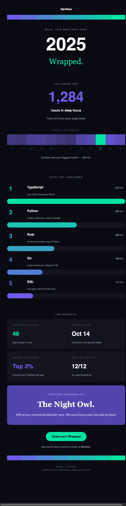
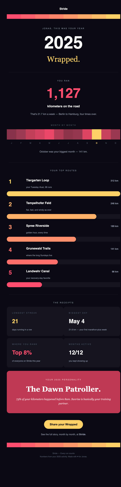
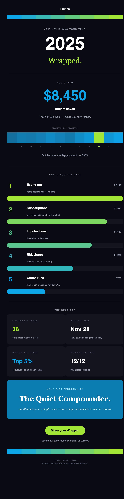
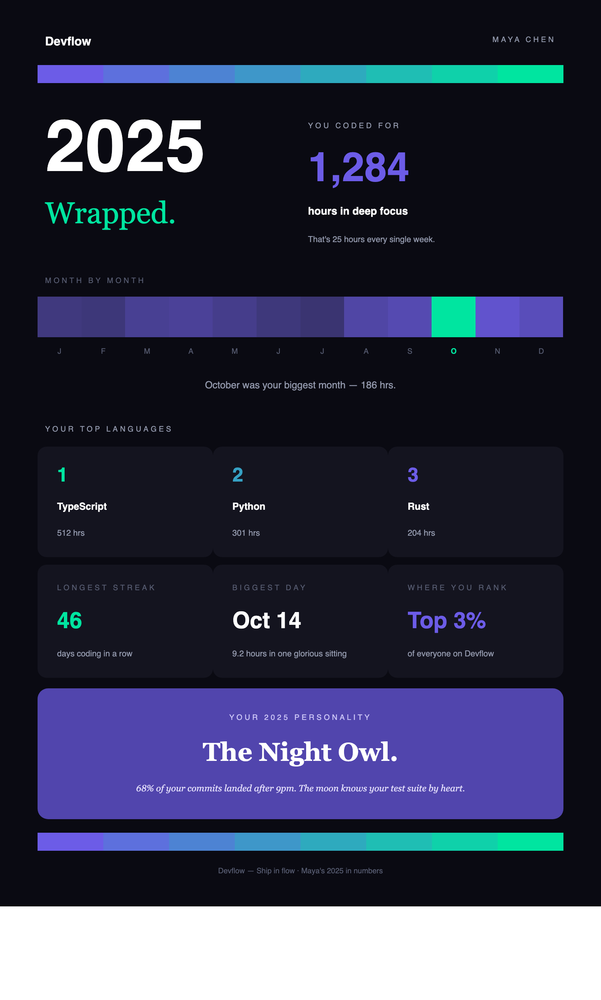
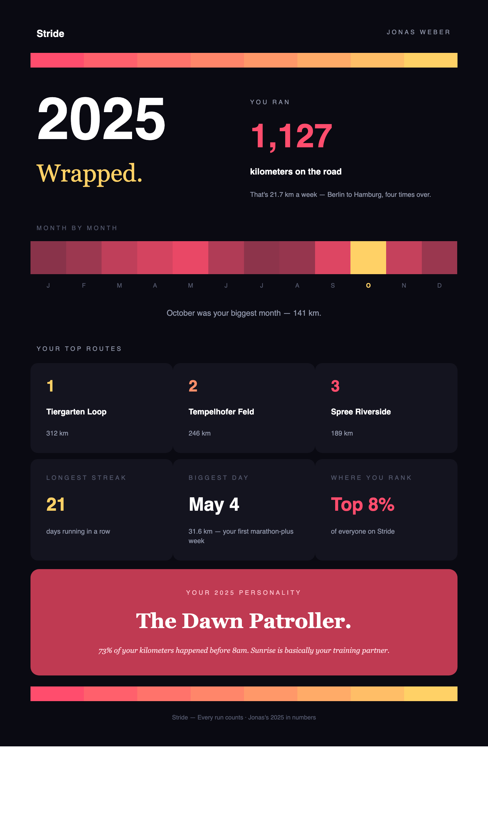
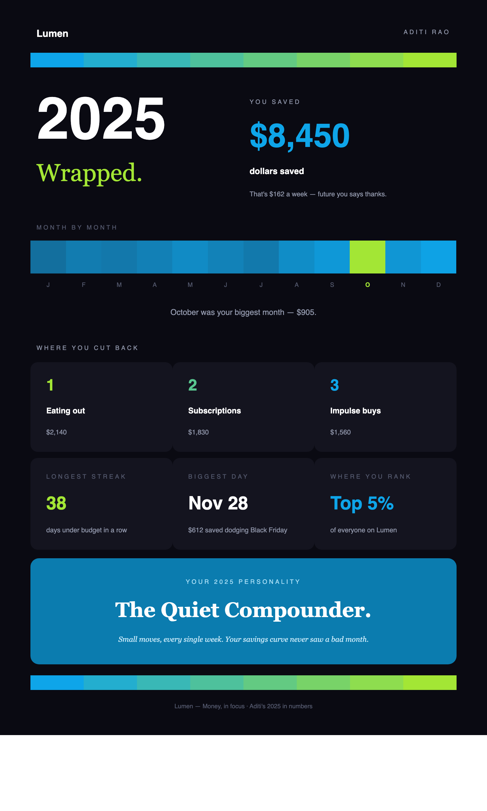
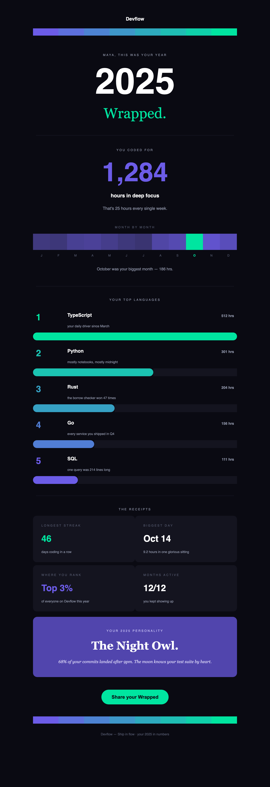
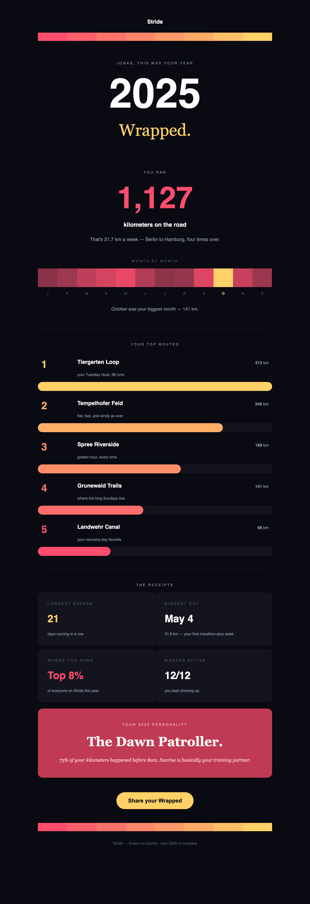

# Wrapped, built with Unlayer Elements

**A Spotify-Wrapped-style personal year-in-review — dark-mode-native, typography-led, and every single chart drawn with `Row`s and `Column`s. Zero images. One data object. Three render modes: a rich HTML email, a shareable web page, and a print-ready PDF poster.**

`#BuiltWithElements`

Unlayer's [template gallery](https://unlayer.com/templates) is light-mode marketing emails built on stock photos — and it has **no `<Document>`/PDF category at all**. This goes the other way: the one recap people actually screenshot and share every year — the annual wrap-up every fitness app, dev tool, and finance app sends — designed the way 2026 email design actually works (**dark-mode-native, the number is the hero, hyper-personalized by construction**) and rendered into the *three* Elements modes at once, including the one nobody else in the gallery ships.

---

## See it first

Three fictional products. **One shared template. One hex pair each.** The email that lands in the inbox:

<table>
<tr>
<td width="33%"><b>Devflow</b> — coding app<br/></td>
<td width="33%"><b>Stride</b> — running app<br/></td>
<td width="33%"><b>Lumen</b> — finance app<br/></td>
</tr>
</table>

Same code, three industries, three moods — indigo→mint for code, coral→gold for running, sky→lime for money. The `$` on Lumen's hero number is data-driven, not hardcoded.

---

## Three modes, one data model

The whole point of Elements is *write once, render everywhere*. This proves it — the same `WrappedContent` object flows into three root wrappers:

| Mode | Wrapper | Output | Preview |
|---|---|---|---|
| **Wrapped email** *(primary)* | `<Email>` | table-based HTML · `text/plain` MIME part · editor JSON | [email ↓](#the-email--email) |
| **Year Poster** *(the flex)* | `<Document>` | one-page HTML → **real PDF** via headless Chrome | [poster ↓](#the-year-poster--document--pdf) |
| **Shareable web page** | `<Page>` | responsive div/flexbox HTML | [page ↓](#the-web-page--page) |

### The Year Poster — `<Document>` → PDF

**This is the mode Unlayer's own gallery doesn't have.** The same year, recomposed as a single portrait page and printed to an actual PDF — the shareable, frame-it, post-it-to-Slack artifact. Two-column masthead, side-by-side hero, the heat strip, a top-3 tile grid, a receipts row, and the persona card, all on one page.

<table>
<tr>
<td width="33%"></td>
<td width="33%"></td>
<td width="33%"></td>
</tr>
</table>

Rendered with `<Document>`, then piped through headless Chrome with print backgrounds forced on and a custom `@page` size — output lands at `demo/output/*.poster.pdf`.

### The email — `<Email>`

Table-based, Outlook/Gmail-safe HTML. Because every chart is drawn from `Row`/`Column` proportions (not fixed images), the layout holds up across clients — and a `no-stack` escape hatch keeps the heat strip and gradient bands horizontal on narrow screens while the ranked-bar labels and stat grid stack cleanly.

<p align="center">

</p>

Every email also emits a **`text/plain` MIME part** (via `renderToPlainText`) and an **Unlayer editor `design.json`** (via `renderToJson`) that round-trips back into the visual editor — so a non-technical marketer can open the generated Wrapped and tweak it by hand.

### The web page — `<Page>`

The "view your Wrapped in the browser" version — same shared sections, wider canvas, responsive div/flexbox HTML.

<table>
<tr>
<td width="50%"></td>
<td width="50%"></td>
</tr>
</table>

---

## What makes it original

- **Every visualization is layout, not images.** There is not a single `` in the entire project:
  - The **monthly heat strip** is 12 `Column`s whose background intensity *is* the data — the peak month burns in the accent color.
  - The **top-5 ranked bars** are `Row cells={[pct, 100 - pct]}` — the bar width *is* the percentage, and the bar color walks the brand→accent gradient down the ranking.
  - The **gradient bands** bracketing the design are 8 `Column`s stepping between the two brand colors.
  - No chart library, no hosted assets — it renders crisp in every client, forever, and there's nothing to break.
- **It cannot break in dark mode, because it *is* dark mode.** Dark-mode rendering is the #1 thing email clients mangle (inverted logos, vanished borders). A dark-mode-native design sidesteps the entire problem class — and matches where 2026 email design is going.
- **Hyper-personalized by construction.** [`lib/generate-content.ts`](lib/generate-content.ts) turns raw product-analytics numbers (12 monthly values, a top list, a streak, a percentile) into a flat, JSON-serializable `WrappedContent` object — intensities, rank percentages, comparison copy, currency formatting. The templates are pure functions of it, so an LLM, an analytics pipeline, or a single CSV row can populate it just as easily as the deterministic generator does.
- **One hex pair re-themes everything.** Brand + accent drive the heat strip, the ranked bars, the gradient bands, the persona card, the poster, and the CTA — the three demo brands (coding, running, finance) share **100% of the template code**.

## Elements is core — exactly how

- **Root wrappers:** `<Email>`, `<Page>`, and `<Document>` — same shared sections, three render modes.
- **Structure:** strict `wrapper → Row → Column → content` throughout; all charts driven by `Row cells` ratios and per-`Column` background colors, with `ColumnLayouts` (`OneColumn`, `TwoEqual`, `ThreeEqual`, `TwoWideNarrow`) for the grids.
- **Components:** `Heading`, `Paragraph`, `Button`, `Divider`, `Column`, `Row`.
- **Render functions:** `renderToHtml` (all three modes), `renderToPlainText` (the email's `text/plain` MIME part), `renderToJson` (emits Unlayer design JSON that **round-trips into the visual editor**).

## Run it

```bash
npm install
npm run render           # → demo/output/*.{html,txt,design.json} + poster PDFs
npm run render:screens   # same, plus PNG screenshots via headless Chrome
```

`npm run render` writes, for each of the three demo users:

```
<user>.email.html          table-based email HTML (no-stack charts hold their proportions)
<user>.email.txt           text/plain MIME part
<user>.email.design.json   Unlayer editor JSON (round-trips into the visual editor)
<user>.page.html           responsive web version
<user>.poster.html         one-page poster HTML
<user>.poster.pdf          the poster, printed to PDF via headless Chrome
```

> **Note:** the poster PDF (and the PNG screenshots) are produced by headless Chrome. `render.tsx` auto-detects Chrome/Chromium at the usual macOS and Linux paths; the HTML/txt/JSON always render even if no browser is found. Generated HTML/PDF/txt/JSON are git-ignored — the committed [`demo/output/screenshots/`](demo/output/screenshots/) PNGs above are the canonical previews.

Outputs land in [`demo/output/`](demo/output/) — one set per user in [`demo/sample-input.json`](demo/sample-input.json) (three fictional products: a coding app, a running app, and a personal-finance app).

## Project layout

```
lib/generate-content.ts   raw yearly numbers → flat WrappedContent (the "AI-populatable" seam)
templates/
  sections.tsx            shared Row/Column sections — heat strip, ranked bars, stat grid, persona card, gradient bands
  wrapped-email.tsx       <Email>    — the Wrapped recap (primary)
  wrapped-page.tsx        <Page>     — the shareable web version
  wrapped-poster.tsx      <Document> — the print-ready Year Poster → PDF
render.tsx                generateContent → renderToHtml/PlainText/Json → files (+ PDF + screenshots)
demo/sample-input.json    three fictional users/products (coding · running · finance)
demo/output/screenshots/  committed PNG previews (all three modes)
```

---

Built with and grateful to [**Unlayer Elements**](https://github.com/unlayer/elements) (MIT) — ⭐ starred and supported. `#BuiltWithElements`
